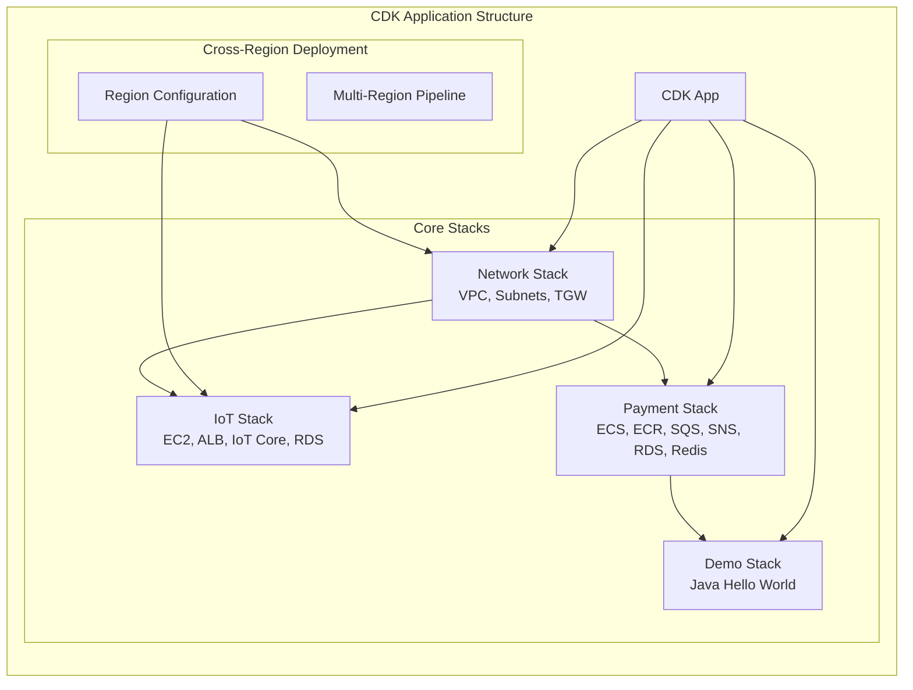

# Requirements Document

## Introduction

This feature demonstrates how to leverage AWS CDK (Cloud Development Kit) as Infrastructure as Code (IaC) to accelerate new deployments across multiple regions for business expansion. The demo showcases a multi-region architecture with two applications: an IoT application that will expand globally and a Payment application that remains centralized in the US but accessible from all regions via Transit Gateway (TGW).

## Architecture Overview

```mermaid
graph TB
    subgraph "US East (Virginia)"
        subgraph "IoT VPC (10.1.0.0/16)"
            IoT_ALB[Application Load Balancer]
            IoT_EC2[EC2 Instances]
            IoT_Core[AWS IoT Core]
            IoT_RDS[RDS MySQL]
            IoT_Subnets["4 Subnets (/24 each)"]
        end
        
        subgraph "Payment VPC (10.2.0.0/16)"
            Pay_ECR[ECR Repository]
            Pay_ECS[ECS Cluster]
            Pay_SQS[SQS Queues]
            Pay_SNS[SNS Topics]
            Pay_RDS[RDS MySQL]
            Pay_Redis[ElastiCache Redis]
            Pay_Subnets["4 Subnets (/24 each)"]
        end
        
        TGW_US[Transit Gateway]
        Pay_NLB[Network Load Balancer<br/>for Cross-Region Access]
    end
    
    subgraph "EU Central (Frankfurt)"
        subgraph "IoT VPC (10.3.0.0/16)"
            IoT_ALB_EU[Application Load Balancer]
            IoT_EC2_EU[EC2 Instances]
            IoT_Core_EU[AWS IoT Core]
            IoT_RDS_EU[RDS MySQL]
            IoT_Subnets_EU["4 Subnets (/24 each)"]
        end
    end
    
    subgraph "AP Southeast (Sydney)"
        subgraph "IoT VPC (10.4.0.0/16)"
            IoT_ALB_AP[Application Load Balancer]
            IoT_EC2_AP[EC2 Instances]
            IoT_Core_AP[AWS IoT Core]
            IoT_RDS_AP[RDS MySQL]
            IoT_Subnets_AP["4 Subnets (/24 each)"]
        end
    end
    
    subgraph "Demo Application"
        Java_App[Java Hello World App]
    end
    
    %% Local connections within regions
    IoT_ALB --> IoT_EC2
    IoT_EC2 --> IoT_Core
    IoT_EC2 --> IoT_RDS
    
    IoT_ALB_EU --> IoT_EC2_EU
    IoT_EC2_EU --> IoT_Core_EU
    IoT_EC2_EU --> IoT_RDS_EU
    
    IoT_ALB_AP --> IoT_EC2_AP
    IoT_EC2_AP --> IoT_Core_AP
    IoT_EC2_AP --> IoT_RDS_AP
    
    Pay_ECS --> Pay_ECR
    Pay_ECS --> Pay_SQS
    Pay_ECS --> Pay_SNS
    Pay_ECS --> Pay_RDS
    Pay_ECS --> Pay_Redis
    
    %% TGW connections within US
    TGW_US --> IoT_EC2
    TGW_US --> Pay_ECS
    
    %% Cross-region access to Payment services
    IoT_EC2_EU -.->|HTTPS/API| Pay_NLB
    IoT_EC2_AP -.->|HTTPS/API| Pay_NLB
    Pay_NLB --> Pay_ECS
    
    %% Demo app deployment
    Java_App --> Pay_ECS
    
    classDef iot fill:#e1f5fe
    classDef payment fill:#fff3e0
    classDef network fill:#f3e5f5
    
    class IoT_ALB,IoT_EC2,IoT_Core,IoT_RDS,IoT_ALB_EU,IoT_EC2_EU,IoT_Core_EU,IoT_RDS_EU,IoT_ALB_AP,IoT_EC2_AP,IoT_Core_AP,IoT_RDS_AP iot
    class Pay_ECR,Pay_ECS,Pay_SQS,Pay_SNS,Pay_RDS,Pay_Redis,Pay_NLB payment
    class TGW_US network
```

### Key Architecture Points:

1. **IoT Application**: Deployed in 3 regions (Virginia, Frankfurt, Sydney) with identical architecture
2. **Payment Application**: Centralized in Virginia, accessible from all regions via Network Load Balancer and HTTPS/API calls
3. **Network Design**: Each region uses /16 CIDR, each application VPC has 4 subnets with /24 masks
4. **Cross-Region Connectivity**: Single Transit Gateway in US for local connectivity, cross-region access via secure API endpoints
5. **Cost Optimization**: Uses one TGW instead of multiple, reducing cross-region data transfer costs
6. **Demo Application**: Java Hello World deployed to ECS to demonstrate end-to-end deployment

### CDK Stack Mapping:

**Stack Responsibilities:**

1. **Network Stack**: Creates VPC, subnets, security groups, Transit Gateway (US only)
2. **IoT Stack**: Deploys IoT-specific resources, depends on Network Stack
3. **Payment Stack**: Deploys payment services, depends on Network Stack
4. **Demo Stack**: Deploys Java Hello World app, depends on Payment Stack
5. **Region Configuration**: Manages region-specific parameters and CIDR blocks
6. **Multi-Region Pipeline**: Orchestrates deployment across multiple regions

## Requirements

### Requirement 1

**User Story:** As a DevOps engineer, I want to deploy IoT applications across multiple AWS regions (Frankfurt, Virginia, Sydney) using CDK, so that I can quickly expand to new business regions with consistent infrastructure.

#### Acceptance Criteria

1. WHEN deploying to a new region THEN the system SHALL create a complete IoT application stack including EC2, ALB, IoT Core, and RDS MySQL
2. WHEN specifying a region THEN the system SHALL automatically configure VPC with /16 CIDR and 4 subnets with /24 masks
3. WHEN deploying IoT stack THEN the system SHALL ensure all components are properly networked and secured
4. IF deploying to Frankfurt, Virginia, or Sydney THEN the system SHALL use region-specific configurations and availability zones

### Requirement 2

**User Story:** As a DevOps engineer, I want to deploy a centralized Payment application in Virginia that's accessible from all regions via internal networking, so that I can maintain payment processing in one location while serving global customers.

#### Acceptance Criteria

1. WHEN deploying Payment application THEN the system SHALL create ECR, ECS, SQS, SNS, RDS MySQL, and ElastiCache Redis in Virginia region
2. WHEN setting up Payment infrastructure THEN the system SHALL configure VPC with /16 CIDR and 4 subnets with /24 masks
3. WHEN establishing cross-region connectivity THEN the system SHALL implement Transit Gateway for internal network access
4. IF accessing from non-US regions THEN the system SHALL route traffic through TGW to Virginia Payment services

### Requirement 3

**User Story:** As a developer, I want a well-organized CDK project structure with TypeScript, so that I can easily maintain and extend the infrastructure code.

#### Acceptance Criteria

1. WHEN creating the project THEN the system SHALL organize code into logical folders: cdk, app, scripts, and configuration directories
2. WHEN writing infrastructure code THEN the system SHALL use TypeScript for all CDK constructs and stacks
3. WHEN structuring the project THEN the system SHALL separate concerns with individual stacks for Network, IoT, Payment, and Demo components
4. WHEN defining stacks THEN the system SHALL use proper dependency management between stacks (Network → IoT/Payment → Demo)
5. IF adding new regions or services THEN the system SHALL allow easy extension through modular design and region configuration files

### Requirement 4

**User Story:** As a developer, I want to include a Hello World demo application in Java, so that I can demonstrate application deployment alongside infrastructure provisioning.

#### Acceptance Criteria

1. WHEN creating the demo THEN the system SHALL include a simple Java Hello World application
2. WHEN deploying the application THEN the system SHALL demonstrate containerization and deployment to ECS
3. WHEN running the demo THEN the system SHALL show end-to-end deployment from code to running application
4. IF testing the deployment THEN the system SHALL provide accessible endpoints to verify functionality

### Requirement 5

**User Story:** As a solutions architect, I want automated infrastructure setup with proper networking and security, so that deployments are consistent and follow AWS best practices.

#### Acceptance Criteria

1. WHEN deploying any stack THEN the system SHALL implement proper security groups and NACLs
2. WHEN creating databases THEN the system SHALL place them in private subnets with appropriate access controls
3. WHEN setting up load balancers THEN the system SHALL configure them in public subnets with proper health checks
4. WHEN establishing cross-region connectivity THEN the system SHALL implement secure API endpoints with proper authentication and encryption
5. IF deploying to multiple regions THEN the system SHALL maintain consistent security posture across all deployments

### Requirement 6

**User Story:** As a DevOps engineer, I want deployment scripts and automation, so that I can easily deploy and manage infrastructure across multiple regions.

#### Acceptance Criteria

1. WHEN running deployment scripts THEN the system SHALL support deployment to specific regions via parameters
2. WHEN deploying infrastructure THEN the system SHALL provide clear feedback on deployment progress and status
3. WHEN managing multiple regions THEN the system SHALL allow selective deployment and updates
4. IF deployment fails THEN the system SHALL provide clear error messages and rollback capabilities
5. WHEN cleaning up resources THEN the system SHALL provide scripts to safely destroy infrastructure in correct order